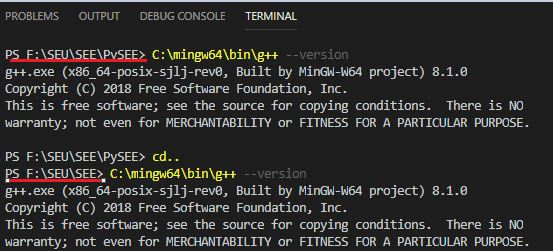

# Windows文件路径

文件位于文件系统的某个路径中，访问文件时需要给出文件的路径。

Files are organized into directories (also called “folders”). Every running program has a **“current directory”**, which is the default directory for most operations.

A string like `C:\mingw64\bin` that identifies a file or directory is called a **path**.

## 绝对路径：从 `盘符` 开始的路径

absolute path: a path that begins with drive letter(e.g C:\() does not depend on the current directory

如C++编译器g++.exe位于C:\mingw64\bin，绝对路径就是C:\mingw64\bin。在任何路径中，都可以用绝对路径访问指定文件

## 相对路径：从 `当前路径` 开始的路径

relative path：a path relates to the current directory

假如当前路径为C:\mingw64\，那么，g++编译器g++.exe相对于C:\mingw64\的相对路径是：`.\bin`

其中，

* `.`表示当前路径. `.`可以缺省，所以，如果一个文件名前没有路径信息，就指在当前路径下。

* `..`为当前路径的上一级目录。

### 如当前路径为C:\mingw64\bin

进入上一级目录C:\mingw64命令是: `cd ..`

### 如hello.cpp位于 F:\SEU\SEE\PySEE\Practices\P1\cpp 路径

在不同路径终端中,使用g++编译hello的命令如下:

* 路径：F:\SEU\SEE\PySEE\Practices\P1\

   

* 路径：F:\SEU\SEE\PySEE\Practices\

  

### 在`源码所在路径打开终端`编译

为了避免不同 **当前路径** 对应不同 **相对路径** 的复杂性，在VS Code中,在**源码所在路径打开终端**，然后，在当前路径终端中，使用g++编译源码hello.cpp

Open the terminal(running cmd/powershell) in the directory of source code files:`F:\SEU\SEE\PySEE\Practices\P1\cpp`, then use `g++` to compile `hello.cpp`

The current directory of  **cmd/powershell** is `F:\SEU\SEE\PySEE\Practices\P1\cpp`

* **cmd/powershell** looks for `g++` in the current directory and the system environment variable **Path**

* **g++** has the same current directory, so it also looks for `hello.cpp` in the current directory

* **cmd/powershell** looks for `./hello.exe` in the current directory 