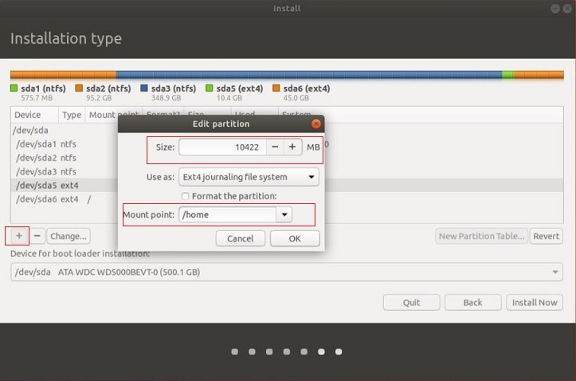
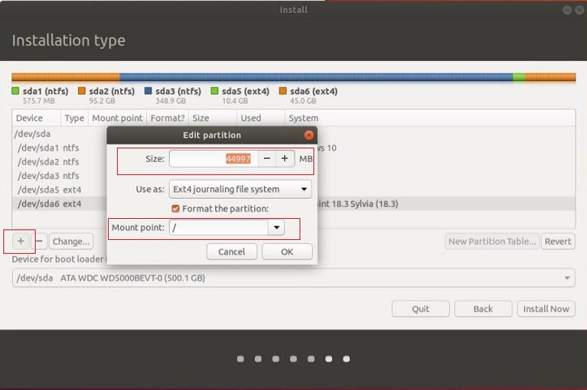
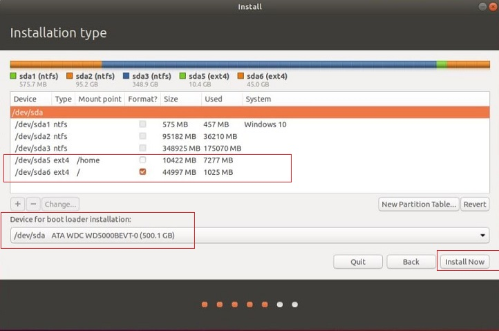

# Ubuntu系统安装和Python,C/C++开发环境的建立

在已安装Windows系统的电脑上，安装Ubuntu系统的过程简介
   
## 一、 准备安装Ubuntu系统需要的空闲硬盘空间

在Windows环境下，从`空余`的硬盘空间中划出一个`空的独立分区`，给Ubuntu使用。建议空间稍大些,以便作为正式的开发环境，如：100G。(基本安装10G也可以)


## 二、 准备Ubuntu安装U盘

* 从Ubuntu官网 https://www.ubuntu.com/download/desktop 下载**偶数年**的长期技术支持LTS版,如：Ubuntu 18.04.2 LTS

  Torrent下载： http://releases.ubuntu.com/18.04.2/ubuntu-18.04.2-desktop-amd64.iso.torrent

* 从 http://rufus.akeo.ie/  下载rufus，用rufus制作可启动的Ubuntu系统安装U盘

* 电脑启动时，通过BIOS/UFEI/(F12,F11 or F2 depending on your computer)，设置电脑从U盘启动，然后，安装Ubuntu

## 三、 安装Ubuntu

安装过程中的主要步骤如下：

### 3.1 基本项目

* 1 Welcome：选择语言 **English**

* 2 Wireless：选择 **不连接无线网络** 

* 3 updates and other software: 选择 **Install third-party software**

  

### 3.2 Installation 

* 4 Installation type（安装类型）

  选择 `something else` (安装类型一定选择为 **`something else`**)

   

* 5 Create Partition（建立分区） 

   在 **`空闲空间（freespace)`** 中定义Ubuntu系统的分区（partition)和挂载点(Mount point)。

    * **注意**：一定要确定使用的是Windows的`空闲空间（freespace)`，不要破坏Windows系统及其用户使用的空间.

   Ubuntu系统的分区很多，快捷安装只需配置:
   
   *  `/home 分区和挂载点` 
   
   *  `/ 系统分区和挂载点`
   
   其他由系统自动配置。

  **`/home` 分区和挂载点**：从**空闲空间**中划出一个分区作为 `/home` 挂载点。
  
     * 一定要有**home**挂载点和分区。如重新安装ubuntu， 仍将这个分区挂载在home下，不要格式化该分区，这样原系统中的用户文件都能保留 

     

  **`/` 系统分区和挂载点**：将余下空闲空间都划给`“/”` 分区，作为系统挂载点。 如果重新安装其他版本Linux，可将这个分区格式化.

   &emsp; &emsp;

  定义好`/home 分区和挂载点` 和 `/ 系统分区和挂载点` 后，可见分区情况：

   &emsp; &emsp;

* 6  Installing 

  点 `Install Now` 前，务必再次确认使用的是 `空闲空间（freespace)`及分区的配置信息正确，不要破坏Windows系统及其用户使用的空间。

  确认分区无误后，点`Install Now`,进入以下步骤：

* 7 Where are you: 选择时区为 **shanghai**

* 8  Who are you: 给出用户名和密码，选择自动登录（为方便使用，**名字和密码宜简短**）

   * 如是重装Ubuntu系统且要使用 **`原home`分区**, 用 **`原用户名`** 

  安装程序将从U盘安装Ubuntu到指定的硬盘分区中。安装过程需要些时间，耐心等待即可。

### 3.3 更新系统

系统安装后，移除U盘，重新启动系统，配置电脑连接Internet, 然后，打开终端（Ctrl+Alt+T), 执行以下命令，更新软件源和系统软件

```bash 
$sudo apt update
$sudo apt upgrade
```

进一步，可对系统桌面做个性化配置，下图是配置后的Ubuntu18.04系统桌面

&emsp;&emsp;

以上是安装过程的要点步骤，详细的安装过程搜索网络。

>
>可选用基于Ubuntu的发行版：
>
>* 1 “中国味”的UbuntuKylin: http://www.ubuntukylin.com/.  UbuntuKylin默认支持中文，预安装有WPS，搜狗拼音输入法等
>* 2 Linux Mint：https://www.linuxmint.com/ Linux Mint易用性高。英文系统系统安装后，需要补充安装中文包及其输入法(如：搜狗输入法)。Linux Mint有多个不同桌面环境的版本，如果电脑性能弱，建议使用Linux Mint Xfce版。


## 四、开发环境

### 4.1 Version Control: Git

```bash 
$sudo apt install git
```

### 4.2 C/C++ With GCC

#### GCC编译器

Ubuntu 18.04 LTS内置GCC编译器，无需安装.

部分Debian/Ubuntu发行版缺少GCC开发支持包，需补充安装：

```bash 
$sudo apt-get install build-essential
```

### 4.3 Python3 and Tools

Ubuntu 18.04 LTS内置Python3. 但不完整，需补充: pip3、idle3。

```bash
$sudo apt install python3-pip
$sudo -H python3 -m  pip install -i https://pypi.tuna.tsinghua.edu.cn/simple pip -U
$sudo apt install idle3
```
目前，Ubuntu系统中同时有Python2和Python3两个版本的解释器。Python3版本的相关命令都加3，如：

```bash
$python3 
$idle3
$pip3
```
### 4.4 Analytics & Scientific Computing Python Packages

Installing from Ubuntu Software Sources

```bash
$sudo apt install python3-numpy python3-scipy python3-matplotlib
```
### 4.5 Installing Python Packages from Pypi

#### 4.5.1 set `tsinghua` as the mirror site of Pypi

```bash
$sudo -H python3 -m pip config set global.index-url https://pypi.tuna.tsinghua.edu.cn/simple
```
#### 4.5.2 Installing Packages

```bash
$sudo -H python3 -m pip install jupyter 
```

```bash
$sudo -H python3 -m pip install seuif97  
```

```bash
$sudo -H  python3 -m pip install iapws 
```

### 4.6 Visual Studio Code

#### 4.6.1 Installing Visual Studio Code

From  https://code.visualstudio.com/docs/?dv=linux64_deb  download VS Code for Debian/Ubuntu,the install in the terminal

```bash
$sudo dpkg -i [vscode filename].deb
```

#### 4.6.2 Installing  Extensions

Install Python Extension in  Visual Studio Code

* https://code.visualstudio.com/docs/languages/python

Install the Microsoft C/C++ extension

* https://code.visualstudio.com/docs/languages/cpp

#### 4.6.3 Set Python3 as the default Python Version

```json
// Path to Python, you can use a custom version of Python by modifying this setting to include the full path.
  "python.pythonPath": "python3",
```

### 4.7 Installing GSL

```bash
$sudo apt install gsl-bin
$sudo apt install libgsl-dev
```
### 4.8 Installing Gnuplot

```bash
$sudo apt install gnuplot
```

## 五、英文版Ubuntu补充中文支持

 为Ubuntu补充中文支持的基本环节,如下：

1. 安装中文语言支持包：`Language Support`-->`Install`

2. 安装中文输入法，建议使用**搜狗拼音输入法**:  https://pinyin.sogou.com/linux/

3. 配置搜狗拼音输入法为系统中文输入方法

具体方法，可上网查询。

## Reference

* How to install and Get Started with Ubuntu Desktop 16.04LTS  http://www3.ntu.edu.sg/home/ehchua/programming/howto/Ubuntu_HowTo.html

* Programmer's Survival Guide for Mac & Ubuntu  http://www3.ntu.edu.sg/home/ehchua/programming/howto/Unix_SurvivalGuide.html

* 优麒麟18.04(UbuntuKylin)简易安装手册 http://www.ubuntukylin.com/public/pdf/UK1804install.pdf
