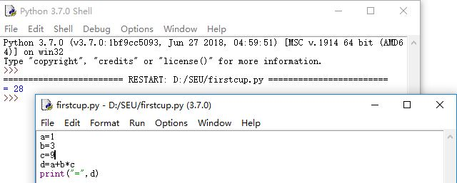
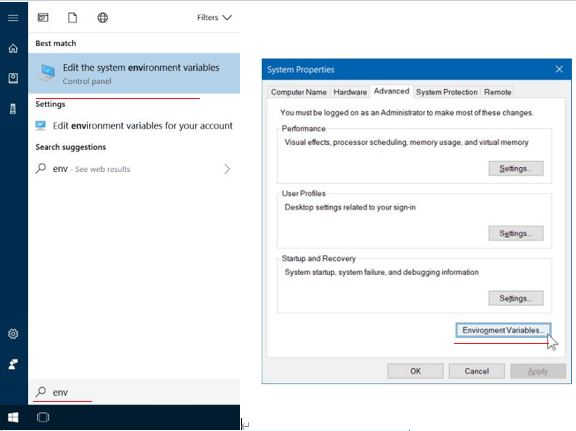
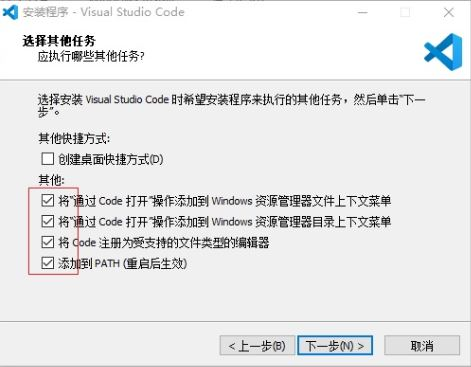
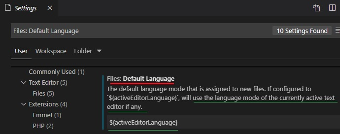
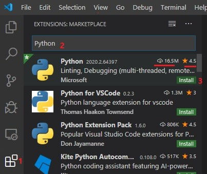
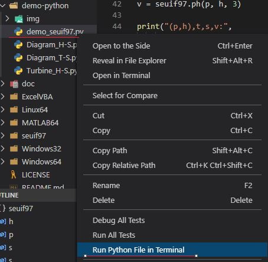
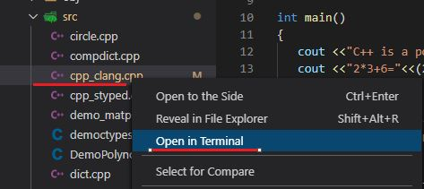
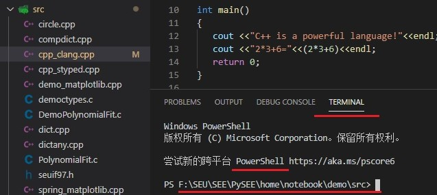

**安装要点**

**Python解释器**

1. 勾选将解释器安装路径加入系统环境变量Path: `Add Python 3.* to PATH`

2. 选择自定义安装：`Customize Installation`，对 `Customize Install location`项目， 按照Python解释器版本号，自定义`简短`的安装目录，如：
      
    *  Python3.7，定义为 `C:\Python37`；Python3.8，定义为 `C:\Python38`

**安装Python软件包**

`pip`命令安装软件包的源是Pypi。因为Pypi服务器在外网，安装速度慢，也可能超时失败，所以，使用`pip`安装软件包前，**务必** 配置软件包源为国内的镜像。推荐使用清华的镜像`tsinghua`为软件包的源。

```bash
>pip config set global.index-url https://pypi.tuna.tsinghua.edu.cn/simple
```
**Visual Studio Code**

1. 安装过程中`勾选`有关项目，方便使用

2. 将Visual Studio Code快捷方式固定到  `任务栏 `

**MinGW-W64(GCC)**

1. 将安装路径加入系统环境变量`Path`

2. 重命名 `mingw32-make.exe` 为 `make.exe`

**请参考如下指导安装软件**

# The Guide of Building Software Environment

Firstly，You **MUST** [setup the working directory for the course](./WorkingDir.md)
<!-- TOC -->

- [The Guide of Building Software Environment](#the-guide-of-building-software-environment)
    - [A:Python & PyPI](#apython--pypi)
        - [A.1 Installing Python and Coding](#a1-installing-python-and-coding)
            - [A.1.1 Customize Installing Python](#a11-customize-installing-python)
            - [A.1.2  Using Python Shell(command-line model)](#a12--using-python-shellcommand-line-model)
            - [A.1.3 Using IDLE(script mode)](#a13-using-idlescript-mode)
        - [A.2 The Python Package Index(PyPI)](#a2-the-python-package-indexpypi)
        - [A.3 Install Packages](#a3-install-packages)
            - [A.3.1 update `pip` to the most recent version](#a31-update-pip-to-the-most-recent-version)
            - [A.3.2 set `tsinghua` as default site](#a32-set-tsinghua-as-default-site)
            - [A.3.3 Install autopep8, pylint](#a33-install-autopep8-pylint)
    - [B:Jupyter Notebook](#bjupyter-notebook)
        - [B.1 Install & Start-up Jupyter Notebook](#b1-install--start-up-jupyter-notebook)
            - [Install Jupyter Notebook extensions(optional)](#install-jupyter-notebook-extensionsoptional)
        - [B.2 Literate programming your Jupyter Notebook in the `specific working folder`](#b2-literate-programming-your-jupyter-notebook-in-the-specific-working-folder)
            - [B.2.1 Start Jupyter Notebook in a specific folder with `batch` file](#b21-start-jupyter-notebook-in-a-specific-folder-with-batch-file)
            - [B.2.2 Create a new notebook document](#b22-create-a-new-notebook-document)
        - [B.3 Using the Jupyter Notebook of PySEE/home](#b3-using-the-jupyter-notebook-of-pyseehome)
    - [C:Install MinGW-W64](#cinstall-mingw-w64)
        - [C.1 Download MinGW-W64](#c1-download-mingw-w64)
        - [C.2 Set MinGW-W64 Environment](#c2-set-mingw-w64-environment)
    - [D:Visual Studio Code](#dvisual-studio-code)
        - [D.1 Install and setup Visual Studio Code](#d1-install-and-setup-visual-studio-code)
            - [D.1.1 Install](#d11-install)
            - [D.1.2 Set the default type of a new file](#d12-set-the-default-type-of-a-new-file)
            - [D.1.3 Set Display Language](#d13-set-display-language)
        - [D.2 Install Extension: Python,C/C++](#d2-install-extension-pythoncc)
        - [D.3 Using Visual Studio Code: Python,C/C++](#d3-using-visual-studio-code-pythoncc)
            - [D.3.1 Getting Started with Python in VS Code](#d31-getting-started-with-python-in-vs-code)
            - [D.3.2 Getting Started with C/C++ in VS Code](#d32-getting-started-with-cc-in-vs-code)
            - [D.3.3 Disable Precompiled header caching](#d33-disable-precompiled-header-caching)
    - [E: Using Git](#e-using-git)
        - [E.1 Install Git for Windows](#e1-install-git-for-windows)
        - [E.2 Using Git with  PySEE/home](#e2-using-git-with--pyseehome)
            - [E.2.1 Clone the PySEE/home to your computer](#e21-clone-the-pyseehome-to-your-computer)
            - [E.2.2 Updating to The Latest Version](#e22-updating-to-the-latest-version)
            - [E.2.3 Discard Changes](#e23-discard-changes)
    - [F:Scientific Computation Packages](#fscientific-computation-packages)
        - [F.1 Scipy](#f1-scipy)
        - [F.2 IAPWS-IF97 Packages:](#f2-iapws-if97-packages)
    - [Extended](#extended)
        - [Python for mobile devices](#python-for-mobile-devices)
            - [Python for Android](#python-for-android)
            - [Python for Apple IOS](#python-for-apple-ios)
        - [Windows10](#windows10)
        - [SEUIF97 Shared Library](#seuif97-shared-library)
        - [Install Python Packages: Third Parties,Requirements](#install-python-packages-third-partiesrequirements)
    - [References](#references)

<!-- /TOC -->
## A:Python & PyPI

Python is one of those rare languages which can claim to be both simple and powerful. You will find yourself pleasantly surprised to see how easy it is to concentrate on the solution to the problem rather than the syntax and structure of the language you are programming in.

Before you start to code Python, you will need Python on your computer.

### A.1 Installing Python and Coding

#### A.1.1 Customize Installing Python

Goto [the official Python site](https://www.python.org/downloads/), you can use typically **Download the latest version of Python** `button` that appears first on the page to get the latest version of Python.

* You may choose the specific Python release for you, e.g. [**Python for Windows**](https://www.python.org/downloads/windows/)

In the example ,we use [Python 3.7.0 for Windows x86-64](https://www.python.org/ftp/python/3.7.0/python-3.7.0-amd64.exe)  

* 1  Make sure you **check** option **Add Python 3.7 to PATH**

* 2  To `change install location`, click on **Customize installation** , enter **C:\python37** in the item of  **Customize installation location**

   

Python is an interpreted language. Python programs are executed by an interpreter. 
  
There are two ways to use the interpreter: 
  
* `command-line` mode
  
* `script` mode

#### A.1.2  Using Python Shell(command-line model)

For Windows users, open [the terminal](./CodingWithTerminal.md) in Windows, click the `Win+R`. In the dialog box, type `cmd` and press `[enter]` key.

Then, type `python` and in the terminal(if you have set the  `PATH` variable appropriately)

You should see the  **Shell**  symbol `>>>` indicating that the interpreter is expecting the user to type some commands(Python code) into the shell.


At the shell prompt `>>>`,if you type a line of code and hit `[enter]`, the interpreter displays the result:

For example, type：

```python
print('Python is a living language!')
```
followed by the `[enter]` key. You should see the words `Python is a living language` printed to the screen.

type：

```python
2*3+6
```
followed by the `[enter]` key. You should see the  value `12` printed to the screen.

**Quit the Python shell**

For Windows users, press `[ctrl + z]` followed by the `[enter]`  key.

     

#### A.1.3 Using IDLE(script mode)

Programmers use some sort of **text editor** that is part of an integrated development environment (IDE) to edit source code of computer programs. 

The **IDLE** is the simple IDE that comes as part of the standard Python installation package.

It provide you with the `File`,`Edit` and `Save As` menus to  edit and save Python source files(script) have names that end with  `.py`.

To execute the program(script), click menu:`Run`->`Run Module`.

  

> The **IDLE** also open a **shell** window into which you can type `Python commands`

### A.2 The Python Package Index(PyPI)

The Python Package Index(PyPI) is a repository of software for the Python programming language.: https://pypi.org/

`pip` is a package manage for Python. It makes installing and uninstalling Python packages

* Installing Python Modules : https://docs.python.org/3/installing/

**A.2.1 Install** 

The following command will install the latest version of a module and its dependencies from the Python Packaging Index:

```bash
>python -m pip install SomePackage  
```

Install the  multiple modules at the one `pip install` command

```bash
>python -m pip install SomePackage1  SomePackage2 
```

**A.2.2 Upgrading**

Normally, if a suitable module is already installed, attempting to install it again will have no effect. Upgrading existing modules must be requested **explicitly**:

```bash
>python -m pip install --upgrade SomePackage  
```
or

```bash
>python -m pip install -U SomePackage  
```

**A.2.3 Install from an alternate index**

```bash
>python -m pip install SomePackage  -i  the-url-of-an-alternate-index
``` 

Install from `@tsinghua` for the **higher speed**: https://pypi.tuna.tsinghua.edu.cn/simple 

```bash
>pip  install packagename  -i  https://pypi.tuna.tsinghua.edu.cn/simple
```

**A.2.4 set one alternate index site as the default site**

```bash
>pip config set global.index-url https://pypi.tuna.tsinghua.edu.cn/simple
```

**A.2.5 uninstall**  

```bash
>pip uninstall packagename  
```

**A.2.6 Show help for commands**

```bash
>pip  help  
```

### A.3 Install Packages

#### A.3.1 update `pip` to the most recent version

```bash
>python -m pip install -U pip -i  https://pypi.tuna.tsinghua.edu.cn/simple
```

   

#### A.3.2 set `tsinghua` as default site 

```bash
>pip config set global.index-url https://pypi.tuna.tsinghua.edu.cn/simple
```

#### A.3.3 Install autopep8, pylint

```bash  
>python -m pip install autopep8 
>python -m pip install pylint
```
or

```bash  
>python -m pip install autopep8 pylint
```

## B:Jupyter Notebook

Interactive analysis and literate programming

http://jupyter.org/

The Jupyter Notebook is an open-source **web application** that allows you to create and share **`documents`** that contain **`live code`**, equations, visualizations and narrative **`text`**. 

Uses include: data cleaning and transformation, numerical simulation, statistical modeling, data visualization, machine learning, and much more.

   

### B.1 Install & Start-up Jupyter Notebook

To install Jupyter,run the following command in a terminal:

```bash   
>python -m pip install jupyter
```

To start up Jupyter, run the following command in a terminal:

```bash   
>jupyter notebook
```

This will launch a new browser window (or a new tab) showing the Notebook Dashboard, a sort of control panel that allows (among other things) to select which notebook to open.

When started, the Jupyter Notebook can access only files within `its start-up folder (including any sub-folder)`.

#### Install Jupyter Notebook extensions(optional)

This repository 

https://github.com/ipython-contrib/jupyter_contrib_nbextensions

contains a collection of extensions that add functionality to the Jupyter notebook.

Install the python package
```bash   
>python -m pip install jupyter_contrib_nbextensions
```
Install javascript and css files

```bash   
>jupyter contrib nbextension install --user
```

### B.2 Literate programming your Jupyter Notebook in the `specific working folder`

#### B.2.1 Start Jupyter Notebook in a specific folder with `batch` file 

* `1` make **the specific folder** for  your Jupyter Notebook,for example: `D:/mynotebook`

* `2` make the **"start.bat"** batch file with the content **`jupyter notebook`** through Windows's **notepad.exe**(记录本)  in the working folder of your Jupyter Notebook

* `3` Double-click **`start.bat`**，the **Jupyter Notebook**  server will automatically open up in your default web browser

   

#### B.2.2 Create a new notebook document

To create a new notebook, click the `New` button on the top of the right hand side and select the `“Python 3”` option. You should see something like the follow Figure. 

If this is your first time, try clicking on the empty `Code cell` and entering a line of Python code. Then press `Shift-Enter` to execute it.

Notebooks consist of a linear sequence of cells. There are two basic cell types:

* `Code cells`: Input and output of live `code` that is run in the kernel

* `Markdown cells`: Narrative `text` with embedded `LaTeX` equations

You can change the cell type by using the `Cell` menu or the toolbar.

You may click  `File`->`Save As...` to save the notebook file as a given name with the extension `.ipynb`.

    
  
### B.3 Using the Jupyter Notebook of PySEE/home

pre-installed:Python3 and Jupyter Notebook

**B.3.1**  Download the zip file

Go to the repo **home** on the Github: https://github.com/PySEE/home ,then download `home.zip` to your computer

   

**B.3.2** Open the notebooks in Jupyter Notebook

 unzip `home.zip`, double-click  `nb.bat`(OS:Windows)  in the sub-folder of **notebook** of `home`. This will open a web page in your browser with a list of the available notebooks.

## C:Install MinGW-W64

### C.1 Download MinGW-W64

Goto [MinGW-W64](https://sourceforge.net/projects/mingw-w64/files/?source=navbar) site, you see that：

**MinGW-W64 GCC-?.?.?**

```bash 
x86_64-posix-sjlj
x86_64-posix-seh
x86_64-win32-sjlj
x86_64-win32-seh 
```
  
Download the latest available version of gcc compiler for **windows64** with **win32 API multithreading** - `x86_64-win32-seh`, for example：

* GCC-8.1.0 [x86_64-win32-seh](https://sourceforge.net/projects/mingw-w64/files/Toolchains%20targetting%20Win64/Personal%20Builds/mingw-builds/8.1.0/threads-win32/seh/x86_64-8.1.0-release-win32-seh-rt_v6-rev0.7z)
 
### C.2 Set MinGW-W64 Environment

**C.2.1** unzip the zipped MinGW-w64,then,remove to **C:\mingw64**

**C.2.2** Add **C:\mingw64\bin** to the system environment variable **Path**

For Windows 10: 

Press `Win+Q`, Open the `Start Search`, type in `env`, and choose `Edit the system environment variables`, choose "**Environment Variables**" button



 Go to the section  "**System Variable**"(the lower half) ⇒ find the "**Path**" row,and click "**edit**" ⇒ Choose "**New**" (add a new folder to  the **Path** variable)  ⇒  Enter the value: **C:\mingw64\bin**


> **Note:** Existing console windows will be using the old path. 
> so that, you will need to reopen any console windows for the new `PATH` location to be available.

**C.2.3** RENAME `C:\mingw64\bin\mingw32-make.exe` to  `C:\mingw64\bin\make.exe`

**C.2.4** Verify the GCC installation by listing the version of gcc:

```bash
> gcc --version
```

## D:Visual Studio Code

Visual Studio Code is a lightweight but powerful source code editor which runs on your desktop and is available for Windows, macOS and Linux. It comes with built-in support for JavaScript, TypeScript and Node.js and has a rich ecosystem of extensions for other languages (such as C++, C#, Python, PHP, Go) and runtimes (such as .NET and Unity). 

### D.1 Install and setup Visual Studio Code 
 
#### D.1.1 Install

* Download  Visual Studio Code https://code.visualstudio.com/, then install

   

* Add the shortcut of VS code to `Task bar`

   
 

#### D.1.2 Set the default type of a new file

By default if you open a new file, it's set for `Plain Text`,

You can set the `default language` at either the user or workspace settings level using `files.defaultLanguage`:

If the item is configured to `${activeEditorLanguage}`, it will use the language mode of the currently active text editor if any.



#### D.1.3 Set Display Language

Press `Ctrl+Shift+P` ,then type `disp`, get the item `Config Display Lanuage`, choice the item,then set the language 


### D.2 Install Extension: Python,C/C++

* Python https://code.visualstudio.com/docs/languages/python

* C/C++ https://code.visualstudio.com/docs/languages/cpp

  

### D.3 Using Visual Studio Code: Python,C/C++

#### D.3.1 Getting Started with Python in VS Code

 https://code.visualstudio.com/docs/python/python-tutorial

It's simple to run Python source code file. `Right-click` in the editor and select `Run Python File in Terminal` (which saves the file automatically):
 
   

   

#### D.3.2 Getting Started with C/C++ in VS Code

* **1** Open the PowerShell terminal in the folder of C++ code file

   

   

* **2** Using g++ to compile the C++ code to the executable file,then running the exe file in the terminal

   

#### D.3.3 Disable Precompiled header caching

The defualt Intelli Sense Cache Size is 5120 MB. 

set the `"C_Cpp.intelliSenseCacheSize:"0` to disable Precompiled header caching   

 

## E: Using Git

We **recommend** that you use [git](https://git-scm.com) to handle everything in the course: the repositories of PySEE,your projects,etc. 

### E.1 Install Git for Windows

Download Git for Windows: https://git-scm.com/ ,then install

### E.2 Using Git with  PySEE/home 

After you have installed **git**, You may use the following **commands:** to clean,update and checkout 

#### E.2.1 Clone the PySEE/home to your computer

```bash
>git clone https://github.com/PySEE/home.git
```

**Cloning the `S2020` branch of repository `shallowly` for saving bandwidth**

```bash
>git clone --depth 1 -b S2020 https://github.com/PySEE/home.git
```
* -b S2020 
* --depth 1 
  * Create a shallow clone with a history truncated to the specified number of commits

When you clone a repository you set up a copy on your computer. This will create a folder **home** on your computer with the files in sub-folders.

#### E.2.2 Updating to The Latest Version

As we release new files or  update files, you'll have to update your repository. You can do this by changing into the `home` directory and executing:

```bash
git pull
```

That's it - you'll have the latest version of the repository.


#### E.2.3 Discard Changes

If you change the contents of home, you may  `checkout` to discard all changes

```bash
>git checkout .
```

>you may also use any **GUI git client** to clone, update and checkout this repository, for example:  [Visual Studio Code](https://code.visualstudio.com/) ,or [GitHub Desktop](https://desktop.github.com/)

## F:Scientific Computation Packages

### F.1 Scipy
   
   Numpy, Scipy, Matplotlib https://www.scipy.org/install.html 

```bash   
> python -m pip install numpy scipy matplotlib
``` 

### F.2 IAPWS-IF97 Packages: 

SEUIF97 

```bash   
> python -m pip install seuif97 
``` 

IAPWS

```bash   
> python -m pip install iapws 
``` 

## Extended

### Python for mobile devices

#### Python for Android

[QPython: Python for Android](https://www.qpython.org/)

QPython is a script engine that runs Python on android devices. It lets your android device run Python scripts and projects. It contains the Python interpreter, console, editor, and the SL4A Library for Android.

#### Python for Apple IOS

[Pythonista 3: A Full Python IDE for iOS](http://omz-software.com/pythonista/)

Pythonista is a complete development environment for writing Python™ scripts on your iPad or iPhone.

### Windows10

64-bit Windows10 

**1 Southeast University**

January 2015, Southeast University and Microsoft Corp provide legitimate Windows, Office for the staffs and students.

  http://nic.seu.edu.cn/2015/0113/c12333a115289/page.htm
  
**2 Microsoft**
  
https://www.microsoft.com/en-gb/software-download/windows10

Do you want to install Windows 10 on your PC?
       
* download and run the media creation tool: 
       https://go.microsoft.com/fwlink/?LinkId=691209
 
### SEUIF97 Shared Library

Go to the repo on the Github：https://github.com/PySEE/SEUIF97 , download SEUIF97.zip


   
*  Unzip the downloaded file,then：
   
   * 1 copy **libseuif97.dll** to c:\windows\system
   * 2 copy **seuif97.py** to the **Lib** dir of installed Python. If you have install Python3.7 in the C:\Python37\, copy to `C:\python37\Lib`

### Install Python Packages: Third Parties,Requirements

* `1` Binary packages are also available from third parties. For Windows, Christoph Gohlke provides [Unofficial Windows Binaries for Python Extension Packages](https://www.lfd.uci.edu/~gohlke/pythonlibs/).

```bash 
>pip install *.whl
```

* `2` Requirements file [requirements.txt](./requirements.txt) is the file containing a list of items to be installed for the course:

```bash 
>python -m pip install -r requirements.txt 
```
## References

* 1 Python3:  https://www.python.org/downloads/
  
  * Guido van Rossum. Python Tutorial. https://docs.python.org/3/tutorial/index.html

* 2 Python Packages

  * Jupyter: http://jupyter.org/

  * Documentation. http://jupyter.readthedocs.org/en/latest/

  * Numpy、Scipy and Matplotlib http://www.scipy.org/ 

    * Scipy. http://www.scipy.org/

    * Numpy. http://www.numpy.org/
  
    * Matplotlib.  http://matplotlib.org/

  * IAPWS-IF97:

     * Shared Lib: https://github.com/PySEE/SEUIF97

     * Python: https://github.com/jjgomera/iapws
 
* 3 Visual Studio Code：https://code.visualstudio.com/

   * Documentation: https://code.visualstudio.com/docs

   * **Markdown** and VS Code： https://code.visualstudio.com/docs/languages/markdown

   * Getting Started with **Python** https://code.visualstudio.com/docs/python/python-tutorial

   * **C/C++** for VS Code： https://code.visualstudio.com/docs/languages/cpp
 
* 4 GCC, the GNU Compiler Collection：http://gcc.gnu.org/

     * MinGW-W64(GCC) Compiler Suite:：http://mingw-w64.org/

     * GCC and Make：Compiling, Linking and Building C/C++ Applications http://www3.ntu.edu.sg/home/ehchua/programming/cpp/gcc_make.html

* 5 Git

    * Git  https://git-scm.com

    * How to get started with GIT and work with GIT Remote Repo  http://www3.ntu.edu.sg/home/ehchua/programming/howto/Git_HowTo.html

    * Git Version Control in VS Code：https://code.visualstudio.com/docs/editor/versioncontrol

    * 知乎：怎样使用GitHub. http://www.zhihu.com/question/20070065