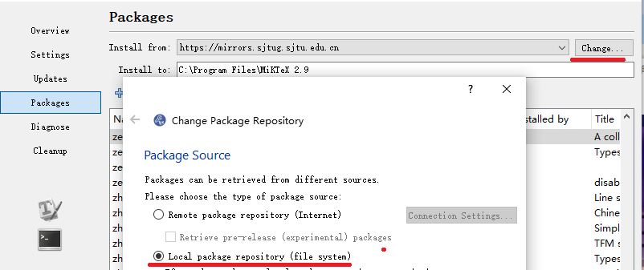

# Problem and Solution
<!-- TOC -->

- [Problem and Solution](#problem-and-solution)
    - [Python解释器`Advanced Options`中选择预编译标准库等时，安装过程很慢或失败](#python解释器advanced-options中选择预编译标准库等时安装过程很慢或失败)
    - [中文Windows10环境下，在VS Codo的PowerShell终端启动Jupyter Notebook后，用户界面为中文](#中文windows10环境下在vs-codo的powershell终端启动jupyter-notebook后用户界面为中文)
    - [print('{:>7.3f}'.format(h)输出运行错误](#print73fformath输出运行错误)
    - [报没有错误语句的“SyntaxError"](#报没有错误语句的syntaxerror)
    - [pip安装时,提示Permission denied](#pip安装时提示permission-denied)
    - [Windows下，MinGW-W64编译UTF-8编码的C++源码，生成的运行文件向终端输出中文乱码](#windows下mingw-w64编译utf-8编码的c源码生成的运行文件向终端输出中文乱码)
    - [Jupyter软件包安装中断后，再次安装中使用cache造成安装过程停滞](#jupyter软件包安装中断后再次安装中使用cache造成安装过程停滞)
    - [命令行执行>jupyter notebook后，jupyter总是启动到C:\Windows\system32](#命令行执行jupyter-notebook后jupyter总是启动到c\windows\system32)
    - [Windows安全防护](#windows安全防护)
    - [module ‘unittest’hasn't the attribute of ‘TestCase’](#module-unittesthasnt-the-attribute-of-testcase)
    - [Windows环境下Jupyter notebook文件转换pdf失败](#windows环境下jupyter-notebook文件转换pdf失败)
        - [ipynb件转换pdf](#ipynb件转换pdf)
            - [需要软件](#需要软件)
            - [ipynb转换为pdf](#ipynb转换为pdf)
                - [方法1：](#方法1)
                - [方法2.](#方法2)

<!-- /TOC -->

## Python解释器`Advanced Options`中选择预编译标准库等时，安装过程很慢或失败

**原因：** Python解释器`Advanced Options`选择安装预编译标准库等时，会从`外网`服务器下载这些库，过程可能比较慢，也可能失败

**解决：**  如果多次安装都失败，不要勾选这些项目
 
## 中文Windows10环境下，在VS Codo的PowerShell终端启动Jupyter Notebook后，用户界面为中文

**原因：** 中文Windows10环境下PowerShell终端的默认字符集编码是中文GBK，Jupyter Notebook启动时被默认配置为其显示语言

**修改**: 在PowerShell终端，执行以下命令,配置字符集编码为英文en_US.UTF-8

```
>set LANG=en_US.UTF-8
```

**Reference**：

Change the (natural) language of the Notebook interface back to English #4158

   https://github.com/jupyter/notebook/issues/4158

   >**tips**: 
   >* Github是软件宝库，也是解决问题的好帮手。一般而言，是软件就会有问题，对于托管在Github的项目，软件的问题会被社区参与者通过issue提出和讨论。
   >* 如果你使用的软件托管在Github, 遇到难以解决的问题时，看看其Github仓库中的issue，也许问题答案就在那里。如果还是没有，你也可提出issue ，寻求帮助。

##  print('{:>7.3f}'.format(h)输出运行错误

`print(str.format)`,输出时，会根据str给出的格式，将变量先转换为对应数据类型，再按照格式要求输出

如：`print('{:>6.3f}'.format(h)`，即： `float(h) -> print`, 如果变量不能转换为对应类型，就会输出运行错误.

**修改**

 数据类型转换异常时，不使用str.format方式输出

```python
try:
    print('{:>7.3f}'.format(h))
except:
    print(h)
```

## 报没有错误语句的“SyntaxError"


**很常见的情况**： 前一句错误，报下面没有错误语言的:`SyntaxError`

因为，Python解释器认为前面一句还没有结束，将前面语言和当前被报错语言作为一个`多行`语句解析，所以，报错在解释器认为的多行语句结束行处 。

>如上图的`（）`配对错误, 报下面的语句 ```Cycle['bwr']=...``` 错误。 Python语言`（）`中可以多行语言。

**改错：** 检查被报错误语句的前面语言，存在什么错误：使得解释器认为前面语言没有结束，是`多行`语句.  

## pip安装时,提示Permission denied

pip安装时,提示Permission denied


根据pip给出的提示加上--user

    >python -m pip install --user  <packagename>

## Windows下，MinGW-W64编译UTF-8编码的C++源码，生成的运行文件向终端输出中文乱码

VS Code是跨平台软件，所有的纯文本类型文件的默认字符集编码都是UTF-8,但是Windows终端的默认字符集编码GBK。两者的默认字符集编码不同，C/C++程序输出UTF-8编码字符不能被GBK编码正确解析，就显示乱码.

UTF-8是Linux默认编码方式，也是很多软件开发工作中的编码。

趋势是UTF-8会成为各种操作系统(包括Windows)和软件的默认字符集编码方式。

因此，宜保持VS Code中程序源码文件的字符集编码为UTF-8，选择采用以下推荐方案之一，输出中文到Windows终端。

1. 高版本的Windows10中，配置UTF-8为默认字符集编码(Beta版)

   

2. 修改Windows终端的字符集编码为UTF-8。在终端执行

    >chcp 65001

3. 使用gcc编译选项，编译生成输出字符的中文编码为GBK的运行文件

    >g++ -o hello hello.cpp -fexec-charset=GBK

## Jupyter软件包安装中断后，再次安装中使用cache造成安装过程停滞

使用 --no-cache-dir 选项安装

```bash
   python -m pip --no-cache-dir install jupyter
```   

##  命令行执行>jupyter notebook后，jupyter总是启动到C:\Windows\system32

**原因**：使用管理员权限运行cmd,都启动到C:\Windows\system32

**解决方法**：使用普通用户权限运行jupyter notebook

## Windows安全防护

微软提供的security essentials是Windows最好的安全防护软件
  
从下面网址下载和操作系统对应的版本的security essentials（**Windows 10默认已经安装**），安装

http://windows.microsoft.com/zh-cn/windows/security-essentials-download
      
安装security essentials后，卸载所有其他各种 **"安全”** 软件。

》 **建议**： 除Googlg Chrome以外，不要安装操作系统以外的其他浏览器
   
## module ‘unittest’hasn't the attribute of ‘TestCase’

03014311 骆应东

我在一开始写单元测试的程序时将其写在一个命名为`unittest`的程序文件里，这个时候运行程序会出现错误` module ‘unittest’hasn't the attribute of ‘TestCase’`提示

通过请教老师、同学，最后发现是因为文件命名为`unittest`，然后当运行程序`import unittest`时系统会‘迷路’，因为文件名和Python的自带包unittest发生混淆，系统无法正确引用Python的unittest包。所以解决办法是：将文件名修改为非unittest即可。

## Windows环境下Jupyter notebook文件转换pdf失败

Jupyter notebook的ipynb文件可以转换为pdf，需要一些软件和软件包.

 转换程序从MiKTex的远程仓库下载软件包时，可能会出现下载失败的问题，导致文档转换中断。

**解决方法**

 1. 选择网络速度快的`镜像站点`

   ```
   >mpm.exe --set-repository=https://mirrors.sjtug.sjtu.edu.cn/ctan/systems/win32/miktex/tm/packages/
   ```
   
 
 2. 配置Miktex软件包离线安装目录(`Package Shell be installed from a local directory`)
 
    从镜像站点下载软件包到本地仓库
    ```bash
    >miktexsetup --verbose --local-package-repository=[the local package repository] --package-set=complete download
    ```
    
 
### ipynb件转换pdf

#### 需要软件

* 1 Windows环境下安装MikTex

* 2 安装pandoc

```bash
>python -m pip install pandoc
```

#### ipynb转换为pdf

##### 方法1：

```bash
>jupyter nbconvert  --to pdf  需要转换的ipynb文件名
```

##### 方法2. 

用Google Chrome浏览器打开ipynb文件，然后, **`Download as`** -> **PDF Via LaTex(pdf)**,生成pdf文件。


